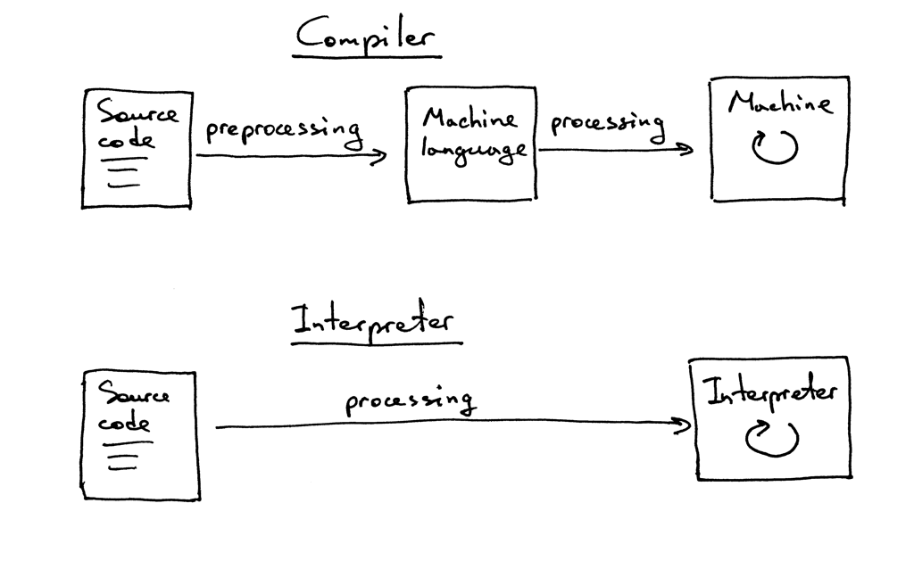

# Notes

Source: [https://ruslanspivak.com/lsbasi-part1/](https://ruslanspivak.com/lsbasi-part1/)

- Why would you study interpreters and compilers? I will give you three reasons.
    1. To write an interpreter or a compiler you have to have a lot of technical skills that you need to use together. Writing an interpreter or a compiler will help you improve those skills and become a better software developer. As well, the skills you will learn are useful in writing any software, not just interpreters or compilers.
    2. You really want to know how computers work. Often interpreters and compilers look like magic. And you shouldn't be comfortable with that magic. You want to demystify the process of building an interpreter and a compiler, understand how they work, and get in control of things.
    3. You want to create your own programming language or domain specific language. If you create one, you will also need to create either an interpreter or a compiler for it. Recently, there has been a resurgence of interest in new programming languages.

- The goal of an **interpreter** or a **compiler** is to translate a source program in some high-level language into some other form. Pretty vague, isn't it? Just bear with me, later in the series you will learn exactly what the source program is translated into.

- At this point you may also wonder what the difference is between an interpreter and a compiler. For the purpose of this series, let's agree that if a translator translates a source program into machine language, it is a **compiler**. If a translator processes and executes the source program without translating it into machine language first, it is an **interpreter**. Visually it looks something like this:

    

- A **token** is an object that has a type and a value. For example, for the string *"3"* the type of the token will be INTEGER and the corresponding value will be integer *3*.
  - The process of breaking the input string into tokens is called **lexical analysis**.
  - So, the first step your interpreter needs to do is read the input of characters and convert it into a stream of tokens. The part of the interpreter that does it is called a **lexical analyzer**, or **lexer** for short. You might also encounter other names for the same component, like **scanner** or **tokenizer**. They all mean the same: the part of your interpreter or compiler that turns the input of characters into a stream of tokens.
  - They all mean the same: the part of your interpreter or compiler that turns the input of characters into a stream of tokens.
