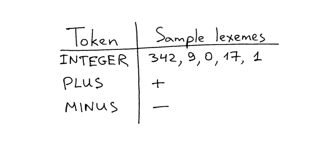

# Notes

**Source**: [https://ruslanspivak.com/lsbasi-part2/](https://ruslanspivak.com/lsbasi-part2/)

- The lesson was clear - to build true virtuosity one must focus on mastering simple, basic ideas.[1](https://ruslanspivak.com/lsbasi-part2/#fn-1)
- *"If you learn only methods, you'll be tied to your methods. But if you learn principles, you can devise your own methods."*
- A **lexeme** is a sequence of characters that form a token. In the following picture you can see some examples of tokens and sample lexemes and hopefully it will make the relationship between them clear:

    

- That's what the ***expr*** method essentially does: it finds the structure in the stream of tokens it gets from the *get_next_token* method and then it interprets the phrase that it has recognized, generating the result of the arithmetic expression.
- The process of finding the structure in the stream of tokens, or put differently, the process of recognizing a phrase in the stream of tokens is called **parsing**. The part of an interpreter or compiler that performs that job is called a **parser**.
- So now you know that the *expr* method is the part of your interpreter where both **parsing** and **interpreting** happen - the *expr* method first tries to recognize (**parse**) the INTEGER -> PLUS -> INTEGER or the INTEGER -> MINUS -> INTEGER phrase in the stream of tokens and after it has successfully recognised (**parsed**) one of those phrases, the method interprets it and returns the result of either addition or subtraction of two integers to the caller.