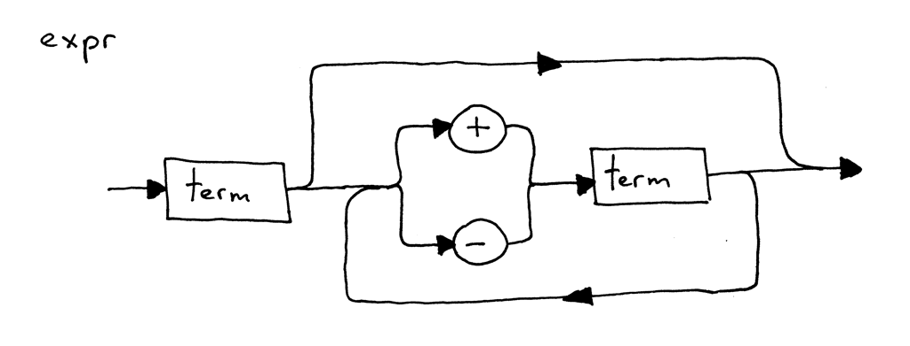

# Assignments

  1. What is a syntax diagram?

      A **syntax diagram** Is a graphical representation of a programming language's syntax rules.

  2. What is syntax analysis?

      **Syntax analysis** is the process of recognizing a phrase in the stream of tokens given as input.

  3. What is a syntax analyzer?

      **Syntax analyzer** is the interpreter segment responsible for the syntax analysis procedure.

      
