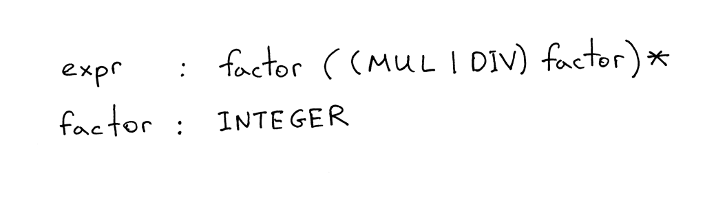

# Assignments

1. What is a context-free grammar (grammar)?

    ⚠️ Context free grammar is a formal grammar which is used to generate all possible strings in a given formal language.

2. How many rules / productions does the grammar have?

    The example grammar contains 2 rules.

3. What is a terminal? (Identify all terminals in the picture)

    All symbols in a string are terminals, in a sense that tree derivation "terminates" on them (i.e. they are leaves in a tree). In our grammar case, our terminal is the INTEGER symbol, meaning that our grammar will always produce an Integer symbol.

    **terminals**: INTEGER, MUL, DIV.

4. What is a non-terminal? (Identify all non-terminals in the picture)

    Non-terminals, in turn, are a form of abstraction that is used in grammar rules - they group terminals and non-terminals together (i.e. they are nodes in a tree).

    **non-terminals**: expr, factor.

5. What is a head of a rule? (Identify all heads / left-hand sides in the picture)

    The head of a rule is the left-hand side and it is a non-terminal symbol.

    **head**: expr, factor.

6. What is a body of the rule? (Identify all bodies / right-hand sides in the picture)

    A body is a  sequence of terminals and/or non-terminals.

    **body**: factor((MUL|DIV)factor)* **and** INTEGER

7. What is the start symbol of a grammar?

