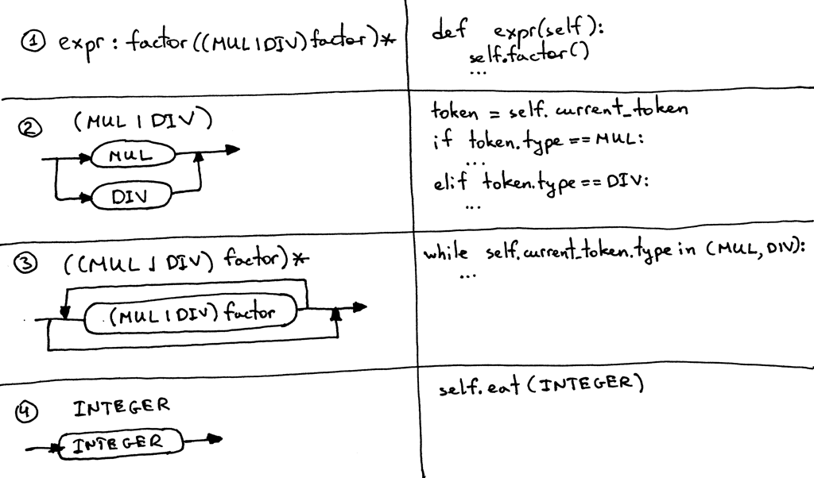

# Notes

**Source** [https://ruslanspivak.com/lsbasi-part4/](https://ruslanspivak.com/lsbasi-part4/)

- **Meta-programming.**

    [What exactly is metaprogramming?](https://stackoverflow.com/questions/514644/what-exactly-is-metaprogramming)

    [Generic programming vs. Metaprogramming](https://stackoverflow.com/questions/3937586/generic-programming-vs-metaprogramming)

- **Meta-syntax and meta-languages.**

    [What are the meanings of metalanguage and metasyntax and EBNF?](https://cs.stackexchange.com/questions/28372/what-are-the-meanings-of-metalanguage-and-metasyntax-and-ebnf)

- **Duck Typing.**

    [What is duck typing?](https://stackoverflow.com/questions/4205130/what-is-duck-typing)

- I will also talk quite a bit today about another widely used notation for specifying the syntax of a programming language. It's called ***context-free grammars*** (***grammars***, for short) or ***BNF*** (Backus-Naur Form). For the purpose of this article I will not use pure [BNF](https://en.wikipedia.org/wiki/Backus%E2%80%93Naur_Form) notation but more like a modified [EBNF](https://en.wikipedia.org/wiki/Extended_Backus%E2%80%93Naur_Form) notation.
- Here are a couple of reasons to use grammars:
    1. A grammar specifies the syntax of a programming language in a concise manner. Unlike syntax diagrams, grammars are very compact. You will see me using grammars more and more in future articles.
    2. A grammar can serve as great documentation.
    3. A grammar is a good starting point even if you manually write your parser from scratch. Quite often you can just convert the grammar to code by following a set of simple rules.
    4. There is a set of tools, called *parser generators*, which accept a grammar as an input and automatically generate a parser for you based on that grammar. I will talk about those tools later on in the series.
- A grammar consists of a sequence of *rules*, also known as *productions*. There are two rules in our grammar:

    

    

- Let's quickly go over the symbols used in the grammar and their meaning.
    - **|** - Alternatives. A bar means "or". So (MUL | DIV) means either MUL or DIV.
    - **( … )** - An open and closing parentheses mean grouping of terminals and/or non-terminals as in (MUL| DIV).
    - **( … )**- Match contents within the group zero or more times.
- A grammar defines a *language* by explaining what sentences it can form. This is how you can *derive* an arithmetic expression using the grammar: first you begin with the start symbol *expr* and then repeatedly replace a non-terminal by the body of a rule for that non-terminal until you have generated a sentence consisting solely of terminals. Those sentences form a *language* defined by the grammar.
- Here are the guidelines that we will use to convert the grammar to source code. By following them, you can literally translate the grammar to a working parser:
    1. Each rule, **R**, defined in the grammar, becomes a method with the same name, and references to that rule become a method call: ***R()***. The body of the method follows the flow of the body of the rule using the very same guidelines.
    2. Alternatives **(a1 | a2 | aN)** become an ***if-elif-else*** statement
    3. An optional grouping **(…)*** becomes a ***while*** statement that can loop over zero or more times
    4. Each token reference **T** becomes a call to the method ***eat***: ***eat(T)***. The way the *eat* method works is that it consumes the token *T* if it matches the current *lookahead* token, then it gets a new token from the lexer and assigns that token to the *current_token* internal variable.

        
