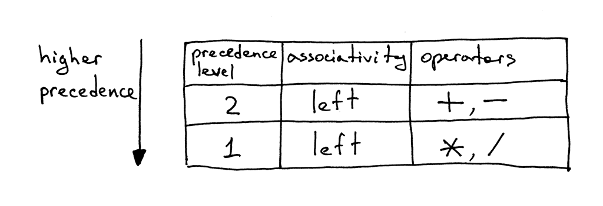
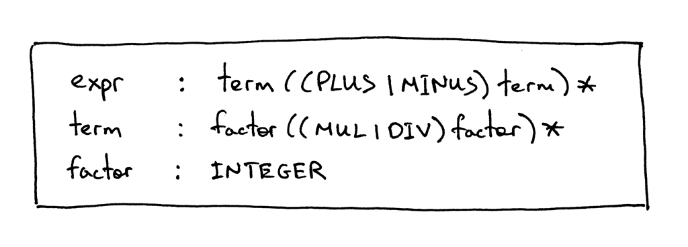
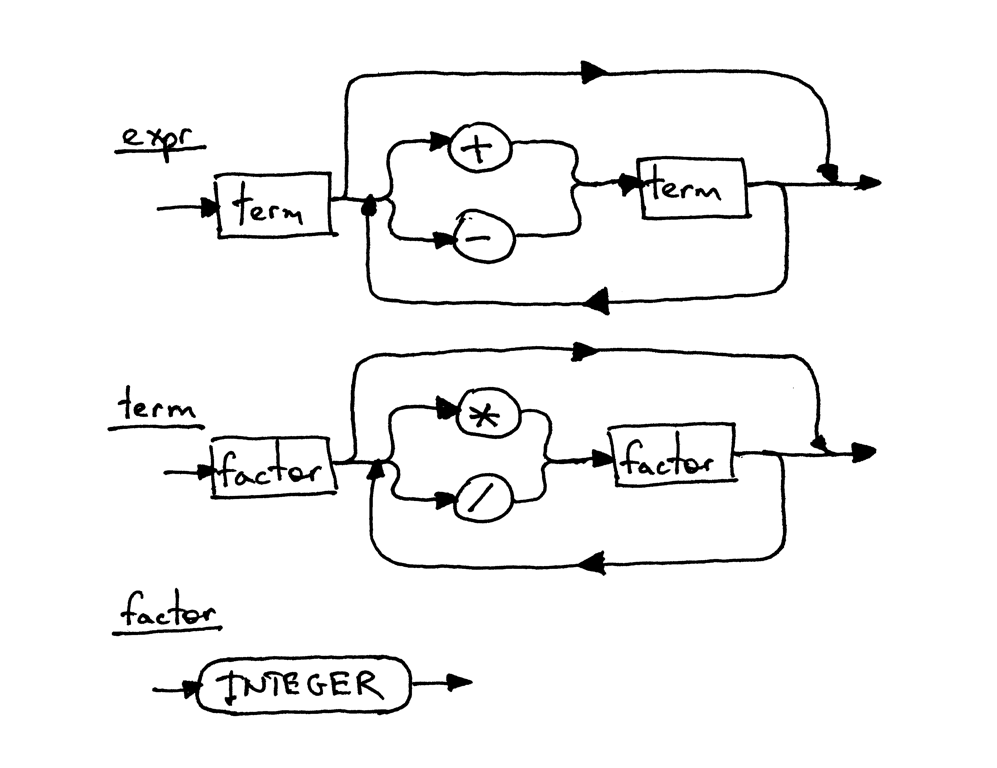

# Notes

**Source** [https://ruslanspivak.com/lsbasi-part5/](https://ruslanspivak.com/lsbasi-part5/)

- I hope you didn't think I wanted to bore you to death by talking so much about the associativity and precedence of operators. The nice thing about those conventions is that we can construct a grammar for arithmetic expressions from a table that shows the associativity and precedence of arithmetic operators. Then, we can translate the grammar into code by following the guidelines I outlined in [Part 4](http://ruslanspivak.com/lsbasi-part4/), and our interpreter will be able to handle the precedence of operators in addition to associativity. **Okay, here is our precedence table:**

    

- From the table, you can tell that operators + and - have the same precedence level and they are both left-associative. You can also see that operators * and / are also left-associative, have the same precedence among themselves but have higher-precedence than addition and subtraction operators.

    Here are the rules for how to construct a grammar from the precedence table:

    1. For each level of precedence define a non-terminal. The body of a production for the non-terminal should contain arithmetic operators from that level and non-terminals for the next higher level of precedence.
    2. Create an additional non-terminal *factor* for basic units of expression, in our case, integers. The general rule is that if you have N levels of precedence, you will need N + 1 non-terminals in total: one non-terminal for each level plus one non-terminal for basic units of expression.

    

    

- And here is the complete code of a calculator that can handle valid arithmetic expressions containing integers and any number of addition, subtraction, multiplication, and division operators.

    The following are the main changes compared with the code from [Part 4](http://ruslanspivak.com/lsbasi-part4/):

    - The *Lexer* class can now tokenize +, -, *, and / (Nothing new here, we just combined code from previous articles into one class that supports all those tokens)
    - Recall that each rule (production), **R**, defined in the grammar, becomes a method with the same name, and references to that rule become a method call: **R()**. As a result the *Interpreter* class now has three methods that correspond to non-terminals in the grammar: *expr*, *term*, and *factor*.