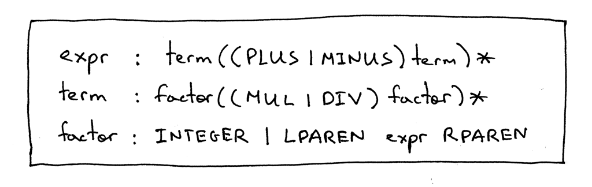
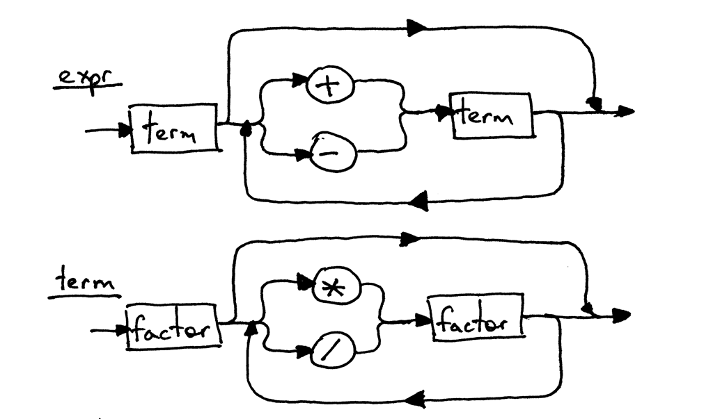
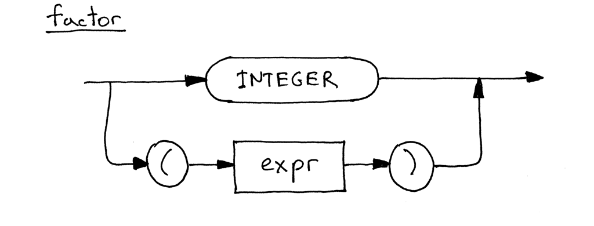
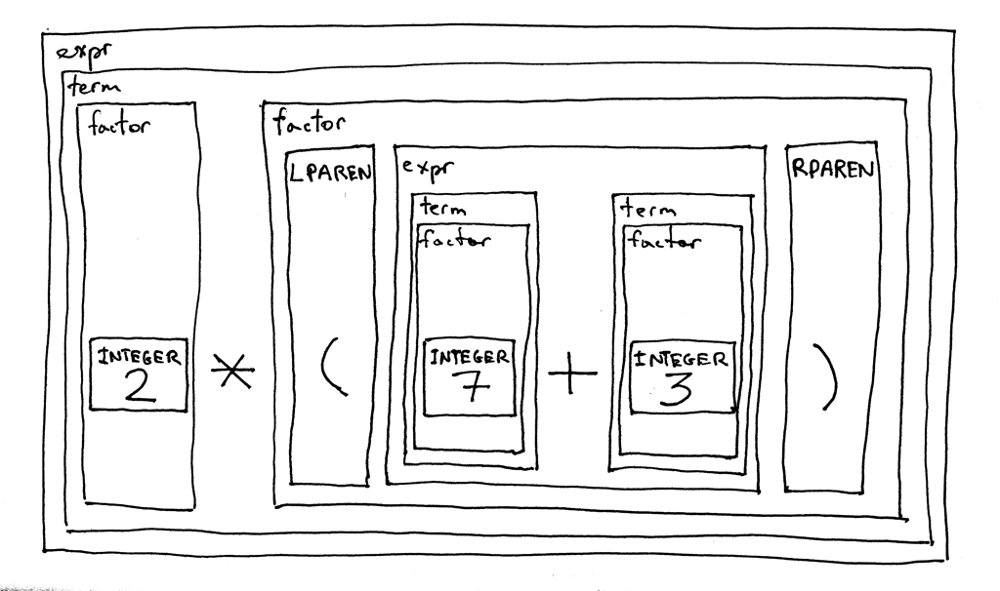

# Notes

**Source** [https://ruslanspivak.com/lsbasi-part6/](https://ruslanspivak.com/lsbasi-part5/)

- First, let's modify the grammar to support expressions inside parentheses. As you remember from [Part 5](http://ruslanspivak.com/lsbasi-part5/), the *factor* rule is used for basic units in expressions. In that article, the only basic unit we had was an integer. Today we're adding another basic unit - a parenthesized expression. Let's do it.

    Here is our updated grammar:

    

- The *expr* and the *term* productions are exactly the same as in [Part 5](http://ruslanspivak.com/lsbasi-part5/) and the only change is in the *factor*production where the terminal LPAREN represents a left parenthesis '(', the terminal RPAREN represents a right parenthesis ')', and the non-terminal *expr* between the parentheses refers to the *expr* rule.

    Here is the updated syntax diagram for the *factor*, which now includes alternatives:

    

    

    
