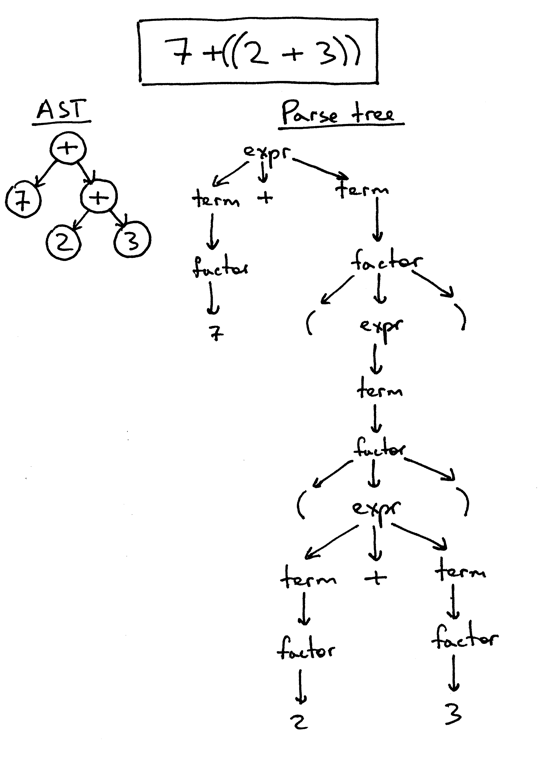

# Notes

**Source** [https://ruslanspivak.com/lsbasi-part8/](https://ruslanspivak.com/lsbasi-part8/)

- Up until now, we had our interpreter and parser code mixed together and the interpreter would evaluate an expression as soon as the parser recognized a certain language construct like addition, subtraction, multiplication, or division. Such interpreters are called ***syntax-directed interpreters***.
- In order to analyze more complex Pascal programming language constructs, we need to build an ***intermediate representation*** (*IR*). Our parser will be responsible for building an *IR* and our interpreter will use it to interpret the input represented as the *IR*.
- Let's quickly talk about tree terminology.
    - A *tree* is a data structure that consists of one or more nodes organized into a hierarchy.
    - The tree has one *root*, which is the top node.
    - All nodes except the root have a unique *parent*.
    - The node labeled **** in the picture below is a *parent*. Nodes labeled **2** and **7** are its *children*; children are ordered from left to right.
    - A node with no children is called a *leaf* node.
    - A node that has one or more children and that is not the root is called an *interior* node.
    - The children can also be complete *subtrees*. In the picture below the left child (labeled ****) of the **+**node is a complete *subtree* with its own children.
    - In computer science we draw trees upside down starting with the root node at the top and branches growing downward.

    

- The IR we'll use throughout the series is called an *abstract-syntax tree* (*AST*). But before we dig deeper into ASTs let's talk about *parse trees* briefly. Though we're not going to use parse trees for our interpreter and compiler, they can help you understand how your parser interpreted the input by visualizing the execution trace of the parser. We'll also compare them with ASTs to see why ASTs are better suited for intermediate representation than parse trees.
- So, what is a parse tree? A *parse-tree* (sometimes called a *concrete syntax tree*) is a tree that represents the syntactic structure of a language construct according to our grammar definition. It basically shows how your parser recognized the language construct or, in other words, it shows how the start symbol of your grammar derives a certain string in the programming language.
- The call stack of the parser implicitly represents a parse tree and it's automatically built in memory by your parser as it is trying to recognize a certain language construct. Let's take a look at a parse tree for the expression 2 * 7 + 3:

    

- In the picture above you can see that:
    - The parse tree records a sequence of rules the parser applies to recognize the input.
    - The root of the parse tree is labeled with the grammar start symbol.
    - Each interior node represents a non-terminal, that is it represents a grammar rule application, like *expr*, *term*, or *factor* in our case.
    - Each leaf node represents a token.
- Now, let's talk about *abstract-syntax trees* (AST). This is the *intermediate representation* (IR) that we'll heavily use throughout the rest of the series. It is one of the central data structures for our interpreter and future compiler projects.

    Let's start our discussion by taking a look at both the AST and the parse tree for the expression 2 * 7 + 3:

    

- As you can see from the picture above, the AST captures the essence of the input while being smaller.

    Here are the main differences between ASTs and Parse trees:

    - ASTs uses operators/operations as root and interior nodes and it uses operands as their children.
    - ASTs do not use interior nodes to represent a grammar rule, unlike the parse tree does.
    - ASTs don't represent every detail from the real syntax (that's why they're called *abstract*) - no rule nodes and no parentheses, for example.
    - ASTs are dense compared to a parse tree for the same language construct.
- So, what is an abstract syntax tree? An *abstract syntax tree* (*AST*) is a tree that represents the abstract syntactic structure of a language construct where each interior node and the root node represents an operator, and the children of the node represent the operands of that operator.
- I've already mentioned that ASTs are more compact than parse trees. Let's take a look at an AST and a parse tree for the expression 7 + ((2 + 3)). You can see that the following AST is much smaller than the parse tree, but still captures the essence of the input:

    

- So far so good, but how do you encode operator precedence in an AST? In order to encode the operator precedence in AST, that is, to represent that "X happens before Y" you just need to put X lower in the tree than Y. And you've already seen that in the previous pictures.

    Let's take a look at some more examples.

    In the picture below, on the left, you can see an AST for the expression 2 * 7 + 3. Let's change the precedence by putting 7 + 3 inside the parentheses. You can see, on the right, what an AST looks like for the modified expression 2 * (7 + 3):

    

    

- From the pictures above you can see that **operators with higher precedence** end up being lower in the tree.
