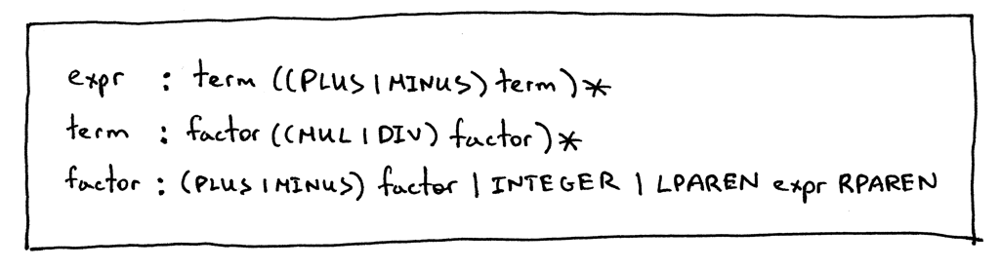

# Notes

**Source** [https://ruslanspivak.com/lsbasi-part8/](https://ruslanspivak.com/lsbasi-part8/)

- **unary operators**, namely unary plus (+) and unary minus (-) operators.
- Here are the rules for unary plus and unary minus operators:
    - The unary minus (-) operator produces the negation of its numeric operand
    - The unary plus (+) operator yields its numeric operand without change
    - The unary operators have higher precedence than the binary operators +, -, *, and /
- Examples of Expressions with Unary operators:

    

    

    

- Since Unary operators have an higher precedence than +, -, * and /, then we should add it to our factor rules, such as:

    

- Here is the full grammar that can now derive expressions with unary plus and unary minus operators:

    
