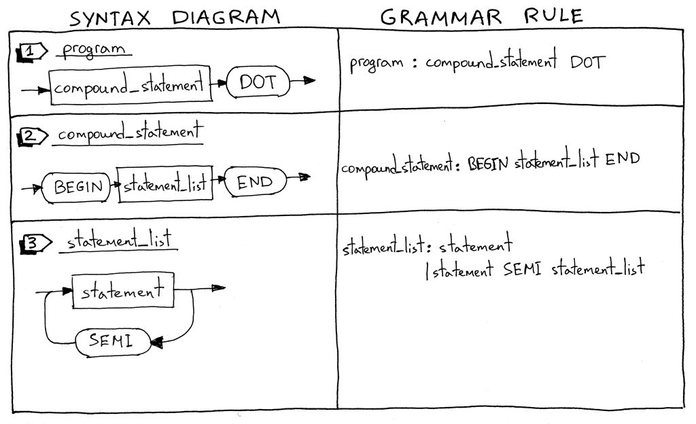
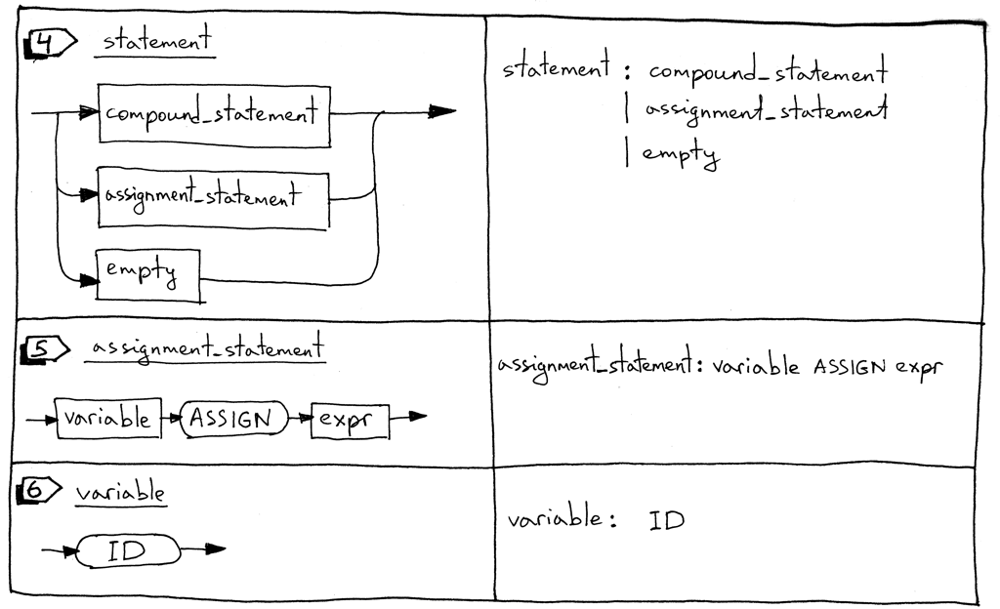
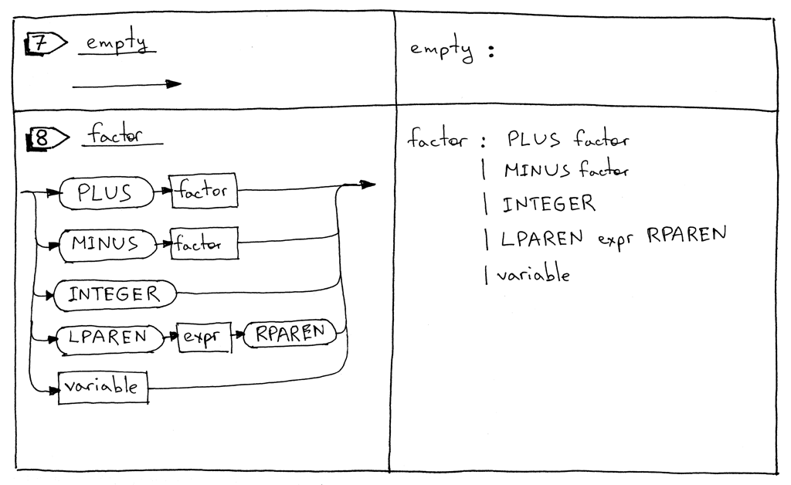
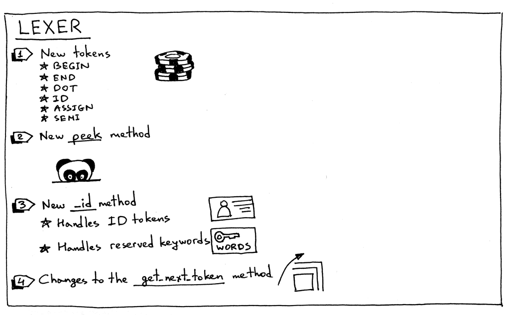
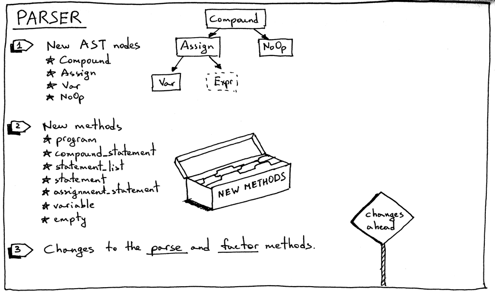
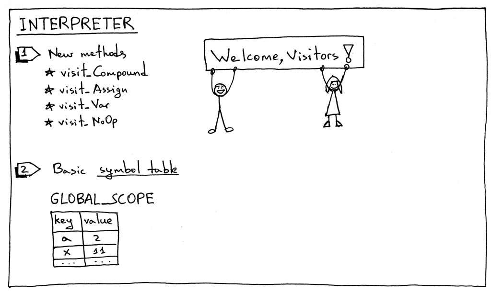

# Notes

**Source** [https://ruslanspivak.com/lsbasi-part9/](https://ruslanspivak.com/lsbasi-part8/)

- In this segment we start to walk towards a solution closer to a pascal interpreter, leaving behind the calculator segment.
- Our goal is to be able to compile something like:

    ```jsx
    BEGIN
        BEGIN
            number := 2;
            a := number;
            b := 10 * a + 10 * number / 4;
            c := a - - b
        END;
        x := 11;
    END.
    ```

- We basically added new rules to our grammar:

    

    

    

    1. I'll start with describing what a Pascal *program* is. A Pascal ***program*** consists of a *compound statement* that ends with a dot. Here is an example of a program:

        `"BEGIN  END."`

        I have to note that this is not a complete program definition, and we'll extend it later in the series.

    2. What is a *compound statement*? A ***compound statement*** is a block marked with BEGIN and ENDthat can contain a list (possibly empty) of statements including other compound statements. Every statement inside the compound statement, except for the last one, must terminate with a semicolon. The last statement in the block may or may not have a terminating semicolon. Here are some examples of valid compound statements:

        `"BEGIN END"
        "BEGIN a := 5; x := 11 END"
        "BEGIN a := 5; x := 11; END"
        "BEGIN BEGIN a := 5 END; x := 11 END"`

    3. A ***statement list*** is a list of zero or more statements inside a compound statement. See above for some examples.
    4. A ***statement*** can be a *compound statement*, an *assignment statement*, or it can be an *empty* statement.
    5. An ***assignment statement*** is a variable followed by an ASSIGN token (two characters, ':' and '=') followed by an expression.

        `"a := 11"
        "b := a + 9 - 5 * 2"`

    6. A ***variable*** is an identifier. We'll use the ID token for variables. The value of the token will be a variable's name like 'a', 'number', and so on. In the following code block 'a' and 'b' are variables:

        `"BEGIN a := 11; b := a + 9 - 5 * 2 END"`

    7. An ***empty*** statement represents a grammar rule with no further productions. We use the *empty_statement* grammar rule to indicate the end of the *statement_list* in the parser and also to allow for empty compound statements as in 'BEGIN END'.
    8. The ***factor*** rule is updated to handle variables.
- Our new grammar become something like:

    ```jsx
    program : compound_statement DOT

        compound_statement : BEGIN statement_list END

        statement_list : statement
                        | statement SEMI statement_list

        statement : compound_statement
                    | assignment_statement
                    | empty

        assignment_statement : variable ASSIGN expr

        empty :

        expr: term ((PLUS | MINUS) term)*

        term: factor ((MUL | DIV) factor)*

        factor : PLUS factor
                | MINUS factor
                | INTEGER
                | LPAREN expr RPAREN
                | variable

        variable: ID
    ```

- Changes to our **lexer**:

    

- Changes to our **parser**:

    

- Changes to our interpreter:

    

- We also created a GLOBAL_SCOPE to store all our variables.