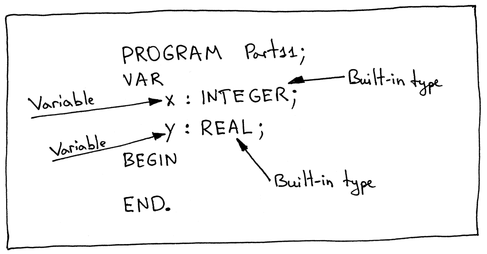

# Notes

**Source** [https://ruslanspivak.com/lsbasi-part11/](https://ruslanspivak.com/lsbasi-part11/)

- Up until now we've learned:
    - How to break sentences into tokens. The process is called ***lexical analysis*** and the part of the interpreter that does it is called a ***lexical analyzer***, ***lexer***, ***scanner***, or ***tokenizer***. We've learned how to write our own ***lexer*** from the ground up without using regular expressions or any other tools like [Lex](https://en.wikipedia.org/wiki/Lex_(software)).
    - How to recognize a phrase in the stream of tokens. The process of recognizing a phrase in the stream of tokens or, to put it differently, the process of finding structure in the stream of tokens is called ***parsing*** or ***syntax analysis***. The part of an interpreter or compiler that performs that job is called a ***parser*** or ***syntax analyzer***.
    - How to represent a programming language's syntax rules with ***syntax diagrams***, which are a graphical representation of a programming language's syntax rules. ***Syntax diagrams*** visually show us which statements are allowed in our programming language and which are not.
    - How to use another widely used notation for specifying the syntax of a programming language. It's called ***context-free grammars*** (***grammars***, for short) or ***BNF*** (Backus-Naur Form).
    - How to map a ***grammar*** to code and how to write a ***recursive-descent parser***.
    - How to write a really basic ***interpreter***.
    - How ***associativity*** and ***precedence*** of operators work and how to construct a grammar using a precedence table.
    - How to build an ***Abstract Syntax Tree*** (AST) of a parsed sentence and how to represent the whole source program in Pascal as one big ***AST***.
    - How to walk an AST and how to implement our interpreter as an AST node visitor.
- What is a ***symbol***? For our purposes, we'll informally define ***symbol*** as an identifier of some program entity like a variable, subroutine, or built-in type. For symbols to be useful they need to have at least the following information about the program entities they identify:
    - Name (for example, 'x', 'y', 'number')
    - Category (Is it a variable, subroutine, or built-in type?)
    - Type (INTEGER, REAL)

    

- What is a ***symbol table***? A ***symbol table*** is an abstract data type (***ADT***) for tracking various symbols in source code. Today we're going to implement our symbol table as a separate class with some helper methods:
