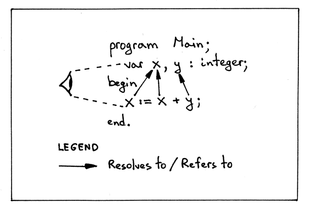

# Notes

**Source** [https://ruslanspivak.com/lsbasi-part14/](https://ruslanspivak.com/lsbasi-part14/)

- Pascal programs are said to be ***lexically scoped*** (or ***statically scoped***) because you can look at the source code, and without even executing the program, determine purely based on the textual rules which names (references) resolve or refer to which declarations. In Pascal, for example, lexical keywords like *program* and *end* demarcate the textual boundaries of a scope:

    

- Why are scopes useful?
    - Every scope creates an isolated name space, which means that variables declared in a scope cannot be accessed from outside of it.
    - You can re-use the same name in different scopes and know exactly, just by looking at the program source code, what declaration the name refers to at every point in the program.
    - In a nested scope you can re-declare a variable with the same name as in the outer scope, thus effectively hiding the outer declaration, which gives you control over access to different variables from the outer scope.
- ASIDE: *Formal parameters* are parameters that show up in the declaration of a procedure. *Arguments* (also called *actual parameters*) are different variables and expressions passed to a procedure in a particular procedure call.
- We've covered a lot of ground. Let's quickly recap what we learned in this article:
    - We learned about *scopes*, why they are useful, and how to implement them in code.
    - We learned about *nested scopes* and how *chained scoped symbol tables* are used to implement nested scopes.
    - We learned how to code a semantic analyzer that walks an AST, builds *scoped symbols tables*, chains them together, and does various semantic checks.
    - We learned about *name resolution* and how the semantic analyzer resolves names to their declarations using *chained scoped symbol tables (scopes)* and how the *lookup* method recursively goes up the chain in a *scope tree* to find a declaration corresponding to a certain name.
    - We learned that building a *scope tree* in the semantic analyzer involves walking an AST, "pushing" a new scope on top of a scoped symbol table stack when ENTERing a certain AST node and "popping" the scope off the stack when LEAVing the node, making a *scope tree* look like a collection of scoped symbol table stacks.
    - We learned how to write a *source-to-source compiler*, which can be a useful tool when learning about nested scopes, scope levels, and name resolution.