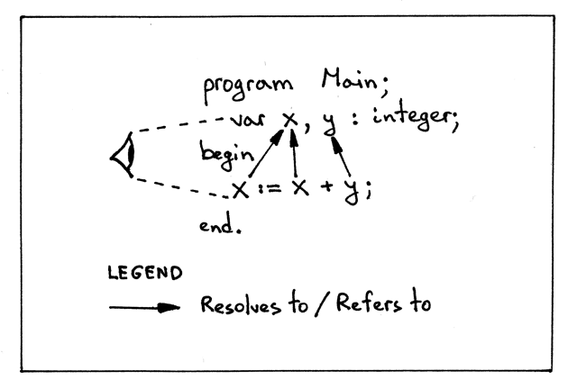
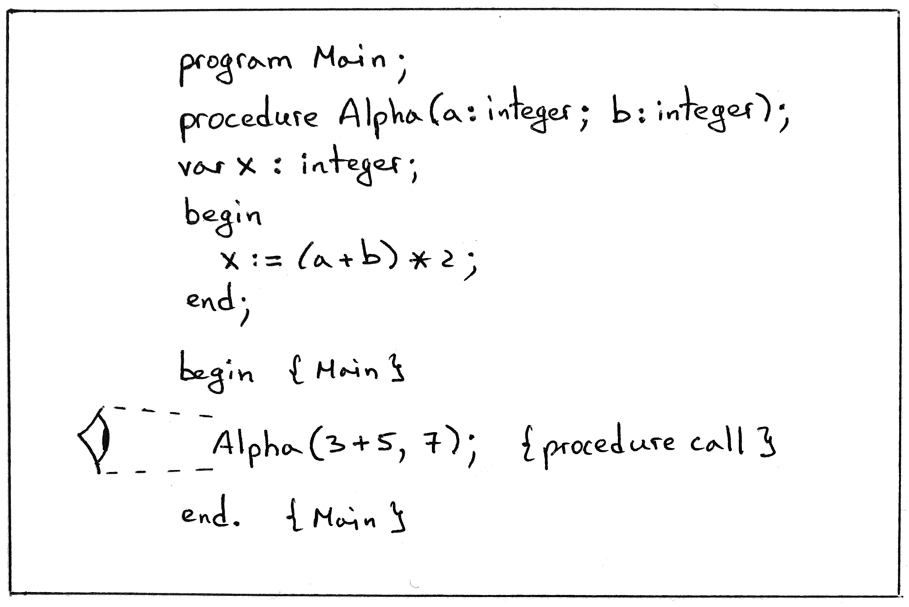

# Notes

- The goal for today is to make sure that when our interpreter reads a program with a procedure call, the parser constructs an Abstract Syntax Tree (AST) with a new tree node for the procedure call, and the semantic analyzer and the interpreter don't throw any errors when walking the AST.

    Let's take a look at a sample program that contains a procedure call *Alpha(3 + 5, 7)*:

    

- First, we need to update the parser. Here is a list of all the parser changes that we need to make to be able to parse procedure calls and build the right AST:
    1. We need to add a new AST node to represent a procedure call
    2. We need to add a new grammar rule for procedure call statements; then we need to implement the rule in code
    3. We need to extend the *statement* grammar rule to include the rule for procedure call statements and update the *statement* method to reflect the changes in the grammar
- `proccall_statement **:** ID LPAREN **(**expr **(**COMMA expr**)*)?** RPAREN`

    
