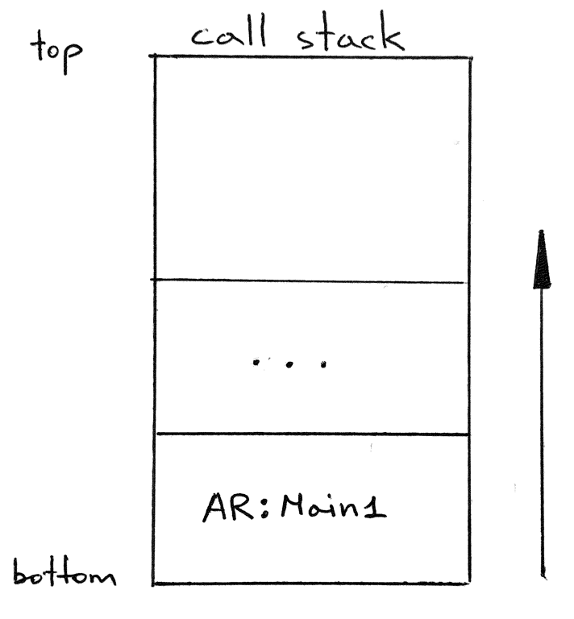

# Notes

- We have a couple of goals for today:
    1. Implement a new memory system that can support programs, procedure calls, and function calls.
    2. Replace the interpreter's current memory system, represented by the *GLOBAL_MEMORY* dictionary, with the new memory system.
- Let's start by answering the following questions:
    1. What is a memory system?
    2. Why do we need a new memory system?
    3. What does the new memory system look like?
    4. Why would we want to replace the *GLOBAL_MEMORY* dictionary?
- *What is a memory system?*
    - To put it simply, it is a system for storing and accessing data in memory. At the hardware level, it is the physical memory (RAM) where values are stored at particular physical addresses. At the interpreter level, because our interpreter stores values according to their variable names and not physical addresses, we represent memory with a dictionary that maps names to values.
    - We've been using this dictionary approach to represent global memory for a while now. We've been storing and accessing variables at the PROGRAM level (the global level) using the *GLOBAL_MEMORY*dictionary.
- 2. *Why do we need a new memory system for our interpreter?*
    - It turns out that having just one dictionary to represent global memory is not enough to support procedure and function calls, including recursive calls.
    - To support nested calls, and a special case of nested calls, recursive calls, we need multiple dictionaries to store information about each procedure and function invocation. And we need those dictionaries organized in a particular way. That's the reason we need a new memory system. Having this memory system in place is a stepping-stone for executing procedure calls, which we will implement in future articles.
- *What does the new memory system look like?*
    - At its core, the new memory system is a stack data structure that holds dictionary-like objects as its elements. This stack is called the "***call stack***" because it's used to track what procedure/function call is being currently executed. The *call stack* is also known as the run-time stack, execution stack, program stack, or just "the stack". The dictionary-like objects that the *call stack* holds are called ***activation records***. You may know them by another name: "stack frames", or just "frames".
    - What is a ***stack***? A ***stack*** is a data structure that is based on a "*last-in-first-out*" policy (*LIFO*), which means that the most recent item added to the stack is the first one that comes out. It's like a collection of plates where you put ("push") a plate on the top of the plate stack and, if you need to take a plate, you take one off the top of the plate stack (you "pop" the plate).
    - Our stack implementation will have the following methods:
        - *push* (to push an item onto the stack)
        - *pop* (to pop an item off the stack)
        - *peek* (to return an item at the top of the stack without removing it)
    - And by our convention our stack will be growing upwards:

        

    - Now, what is an ***activation record***? For our purposes, an *activation record* is a dictionary-like object for maintaining information about the currently executing invocation of a procedure or function, and also the program itself. The activation record for a procedure invocation, for example, will contain the current values of its formal parameters and its local variables.
        - There are a few things worth mentioning:

            a. The *ActivationRecord* class constructor takes three parameters:

            - the *name* of the activation record (AR for short); we'll use a program name as well as a procedure/function name as the name for the corresponding AR
            - the *type* of the activation record (for example, PROGRAM); these are defined in a separate enumeration class called *ARType (activation record type)*
            - the *nesting_level* of the activation record; the nesting level of an AR corresponds to the scope level of the respective procedure or function declaration plus one; the nesting level will always be set to 1 for programs, which you'll see shortly

            b. The *members* dictionary represents memory that will be used for keeping information about a particular invocation of a routine. We'll cover this in more detail in the next article

            c. The *ActivationRecord* class implements special *__setitem__()* and *__getitem__()* methods to give activation record objects a dictionary-like interface for storing key-value pairs and for accessing values by keys: *ar['x'] = 7* and *ar['x']*

            d. The *get()* method is another way to get a value by key, but instead of raising an exception, the method will return *None* if the key doesn't exist in the *members* dictionary yet.

            e. The *__str__()* method returns a string representation of the contents of an activation record